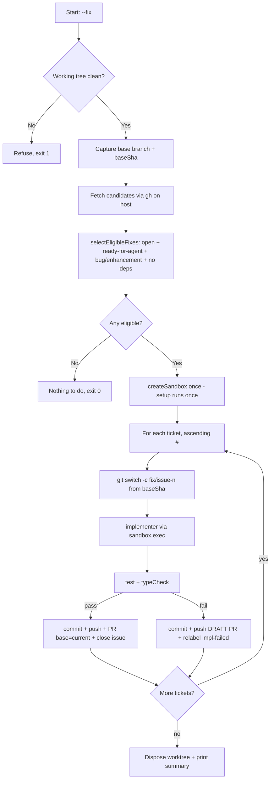

<!-- GitHub: #76 https://github.com/tedyeates/kiro-skills/issues/76 -->

# Sandcastle Fix Mode

## Problem Statement

The Sandcastle Runner is built for a PRD's worth of work: a parent issue with linked
sub-issues, a blocker graph, a long-lived feature branch, and an implementer→reviewer
retry loop gated on deterministic checks. That ceremony is overkill for the steady
stream of small, independent bug fixes and enhancements that already exist as standalone
tickets. There is currently no way to point the runner at "all the small ready tickets
in this repo" and have it grind through them unattended.

## Solution

Add a `--fix` mode to the existing Sandcastle Runner (`main.template.ts`). Instead of
sourcing tasks from a PRD's sub-issues, it scans the whole repo for standalone tickets
that are ready and dependency-free, and processes each one on its own branch into a
PR targeting the branch you launched from. It reuses Sandcastle's Docker sandbox,
headless auth, deterministic checks, and prompt/logging helpers, but drops the reviewer,
the blocker graph, and the halt-on-failure behaviour. One implementer attempt per
ticket; failures are parked as draft PRs and relabelled rather than halting the run.

Because the tickets are independent, all work happens inside **one** Sandcastle worktree
created once per run (dependencies installed once), with a fresh branch cut from the
launch commit for each ticket via in-place `git switch -c`. This avoids the per-worktree
reinstall cost that made per-task worktrees expensive.

## User Stories

1. As a developer, I want to run `npx tsx .sandcastle/main.ts --fix` so that every ready, standalone ticket in my repo is implemented automatically without assembling a PRD.
2. As a developer, I want the loop to select only tickets labelled `ready-for-agent` that are also `bug` or `enhancement`, so that I control what the loop touches via a normal triage pass.
3. As a developer, I want tickets that have any blocking dependency to be skipped, so that the loop stays dumb and never tries to order work — dependent work belongs in the PRD/wayfinder flow.
4. As a developer, I want each ticket implemented on its own branch cut from the branch I launched from, so that fixes stay independent and individually reviewable.
5. As a developer, I want each successful ticket to open its own PR targeting my current branch (not `main`), so that I can stack fixes onto the feature branch I'm already working on and merge that upward later.
6. As a developer, I want the loop to close the ticket itself after opening its PR, so that the board reflects progress even though the PR base is not the default branch (so merge-based auto-close won't fire).
7. As a developer, I want deterministic `test` + `typeCheck` to gate each ticket before push, so that only green fixes reach a non-draft PR.
8. As a developer, I want a failed ticket pushed as a draft PR and relabelled `impl-failed` (with `ready-for-agent` removed), so that I can inspect the attempt and my next triage pass catches it, without the ticket being re-picked.
9. As a developer, I want no reviewer and no second implementer attempt on failure, so that the loop is fast and cheap — a human investigates failures.
10. As a developer, I want the loop to skip a failed ticket and continue, so that one bad fix never blocks the rest of the batch.
11. As a developer, I want dependencies installed once per run (single worktree, in-place branch switching), so that a batch of ten tickets doesn't pay ten `pnpm install`s.
12. As a developer, I want the loop to refuse to start if my working tree is dirty, so that it never mixes my uncommitted work into an agent branch.
13. As a developer, I want a `--dry-run` that prints the eligible ticket plan without spinning up Docker, so that I can preview what the loop will do.
14. As a developer, I want agent output logged to `.sandcastle/logs/<n>-implementer.log` and concise status lines in the terminal, consistent with PRD mode.
15. As a developer, I want an end-of-run summary (N fixed with PR links, M failed with labels), so that I know the outcome at a glance.
16. As a developer, I want the `setup` skill to provision the labels this loop depends on (`ready-for-agent`, `impl-failed`), so that a fresh repo works without manual label creation.
17. As a developer, I want the `wayfinder:grilling` label renamed to `grilling` (and the `wayfinder` skill updated), so that grilling tickets carry a cleaner, flow-agnostic name.

## Diagrams

**Fix-mode ticket lifecycle:**

## Testing Seams

| Seam | Existing/New | Modules it covers | How tests use it |
|------|-------------|-------------------|-----------------|
| `selectEligibleFixes(issues)` | New (pure fn) | Eligibility predicate | Feed synthetic issue arrays (varying labels, states, dependency edges); assert the exact eligible subset and ordering. This is the defining, error-prone logic. |
| `--dry-run` | Existing pattern (PRD mode) | Sourcing + selection + planning | Run against a repo/fixture; assert the printed plan lists the right tickets and no Docker sandbox is created. |
| Deterministic checks (`runChecks`) | Existing | Verification | Reused unchanged from PRD mode; already the sole pass/fail authority. |

The orchestrator body (`runFix`) is glue code — like PRD mode, it is verified via
`--dry-run` and real runs rather than unit tests. Only the pure selection function is
unit-tested initially. If `runFix` grows complex, extract and test further.

## Implementation Decisions

### Mode dispatch
- `main()` parses flags and dispatches: `--prd <n>` → existing `runPrd()` (the current
  `main()` body, extracted), `--fix` → new `runFix()`. Exactly one mode per invocation;
  error if neither/both supplied.
- Shared helpers are reused verbatim: `ensureAuth`, `runChecks`, `escapeShell`,
  `buildImplementerPrompt`, `log`, `elapsed`, `liveStream`, and the `config` block.

### Task sourcing (`fetchFixCandidates`, host-side `gh`)
- Query open issues carrying `ready-for-agent`:
  `gh issue list --repo <repo> --state open --label ready-for-agent --json number,title,body,labels` (plus dependency info).
- Dependency detection reuses the PRD-mode approach
  (`api repos/<repo>/issues/<n>/dependencies/blocked_by`), but the rule is simpler:
  **any** blocking edge → ineligible (no open/closed distinction).
- `gh` runs on the host only; no GitHub credentials enter the container (same as PRD mode).

### Eligibility predicate (`selectEligibleFixes`, pure)
- Eligible ⇔ `state === "open"` AND has `ready-for-agent` AND (`bug` OR `enhancement`)
  AND has zero `blocked_by` edges.
- Ordering: ascending issue number.
- Pure function over an in-memory issue list — no I/O — so it is the unit-test seam.

### Sandbox & git topology
- **One** `createSandbox({ branch: "fix/issue-<first>", baseBranch: <launch branch> })`
  for the whole run; `onSandboxReady` runs `config.setup` once.
- `baseSha` = the launch branch's commit, captured on the host before sandbox creation.
- Per ticket, inside the single worktree: `git switch -c fix/issue-<n> <baseSha>`.
  Never `git switch` **to** the base branch (git forbids checking out a branch already
  checked out in the main repo); every fix branch is cut from `baseSha` directly, so no
  "switch back" step is needed. `node_modules`/`.venv` persist across switches because
  they are gitignored and the worktree directory is constant → install once per run.
- Implementer runs via `sandbox.exec("kiro-cli chat --no-interactive --agent implementer ...")`,
  same mechanism as PRD mode. Implementer commits its own work.

### Per-ticket outcome
- **Pass** (`test` + `typeCheck` green): host pushes the branch, opens a **non-draft** PR
  with `--base <launch branch>` and `Closes #<n>`, then the loop closes the issue via
  `gh issue close` (auto-close won't fire since base ≠ default branch).
- **Fail**: commit whatever the implementer produced, push, open a **draft** PR (for
  inspection), then relabel — remove `ready-for-agent`, add `impl-failed`. Do **not**
  retry, do **not** run a reviewer. Continue to the next ticket.
- **No reviewer** in fix mode at all.

### Startup guards & lifecycle
- Refuse to start (`exit 1`) if the working tree is dirty (`git status --porcelain`).
- If no eligible tickets: `exit 0` "Nothing to do" without creating a sandbox.
- `--dry-run`: print the eligible plan (and the skipped-with-reason list) and exit before
  any Docker work.
- End-of-run summary: N fixed (with PR URLs), M failed (labelled `impl-failed`, with draft PR URLs).

### Side-tasks (separate from the runner change)
- **`setup` skill**: add `impl-failed` (and confirm `ready-for-agent`, `bug`, `enhancement`)
  to the labels it provisions, so fix mode works on a fresh repo.
- **Label rename**: `wayfinder:grilling` → `grilling`; update the `wayfinder` skill and any
  references. Existing tickets carrying the old label must be migrated (rename the label in
  GitHub so issues keep it).

### Future backlog (not this spec, no ADR)
- Build a **kiro agent provider** for `@ai-hero/sandcastle`. Once it exists, fix mode can
  move to `run({ branchStrategy: { type: "head" } })` for a no-worktree, in-place,
  install-once first-class mode, dropping the single-worktree install hit and any need to
  bypass `createSandbox`. The current single-worktree design is deliberately close to this
  shape to make the swap a drop-in.

## Testing Decisions

- **Unit**: `selectEligibleFixes` — synthetic issue arrays covering: missing
  `ready-for-agent`; has `ready-for-agent` but neither `bug` nor `enhancement`; has a
  dependency edge; closed state; the happy case; and mixed sets to assert ascending-number
  ordering. Test only through the function's return value (external behaviour).
- **Integration**: `--dry-run` produces the correct plan and creates no sandbox.
- Reuse the existing `runChecks` verification path unchanged; no new tests for it.
- Prior art: PRD mode is verified the same way (dry-run + real runs); fix mode follows suit.

## Out of Scope

- Parallel ticket execution (strictly sequential, one worktree).
- Reviewer agent in fix mode.
- Second implementer attempt / retry loop.
- Blocker-graph resolution or wave computation (any dependency → skip).
- Halt-on-failure (fix mode always skips-and-continues).
- Building the kiro agent provider (future backlog).
- Resuming / label-based state machine across runs.

## Further Notes

- **PR base branch must exist on the remote.** `gh pr create --base <launch branch>`
  requires the launch branch to be pushed. If it isn't, PR creation fails — the loop
  should surface a clear error. (Typical case: you're already working on and have pushed
  `prd-1`.)
- Launching from the default branch (`main`) is allowed but means PRs target `main`
  directly and `Closes #<n>` would auto-close on merge — the explicit `gh issue close`
  is then redundant but harmless.
- `config` gains no required fields; fix mode reuses `repo`/`setup`/`test`/`typeCheck`/
  `timeoutSeconds`. Any fix-specific knobs (e.g. label names) should default to the repo's
  existing labels.
