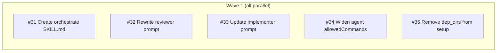

# Dependency Graph

```mermaid
graph LR
  subgraph "Wave 1 (all parallel)"
    T31[#31 Create orchestrate SKILL.md]
    T32[#32 Rewrite reviewer prompt]
    T33[#33 Update implementer prompt]
    T34[#34 Widen agent allowedCommands]
    T35[#35 Remove dep_dirs from setup]
  end
```

All tasks are independent — no cross-dependencies. Single wave.
