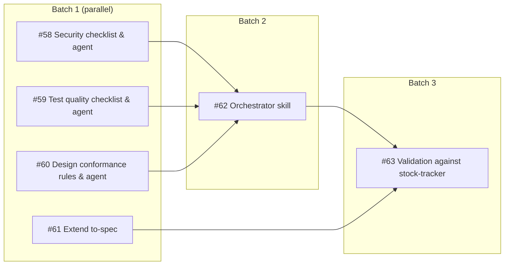

# Dependency Graph: PR Review Companion Skills

## Issue Index

| # | Title | Blocked by |
|---|-------|-----------|
| #58 | Security review checklist and agent | — |
| #59 | Test quality checklist and agent | — |
| #60 | Design conformance rules and agent | — |
| #61 | Extend to-spec with security.md and testing.md | — |
| #62 | Orchestrator skill (pr-review) | #58, #59, #60 |
| #63 | Validation against stock-tracker | #62, #61 |
