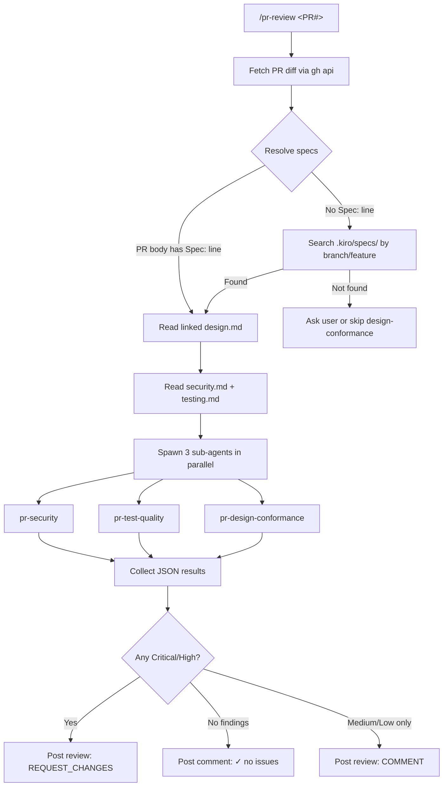
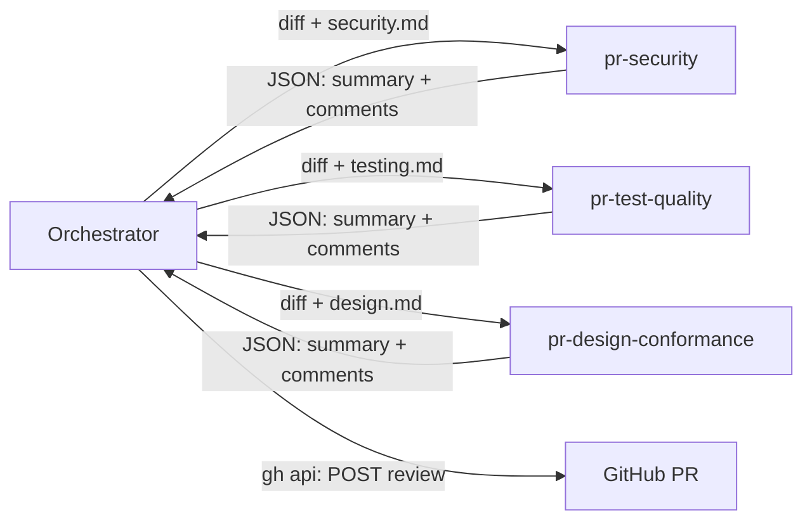

<!-- GitHub: #57 https://github.com/tedyeates/kiro-skills/issues/57 -->

# PR Review Companion Skills

## Problem Statement

After implementation, PRs need review across three dimensions that the existing `code-review` skill doesn't cover: security vulnerabilities (OWASP/ASVS), test quality gaps (coverage, mock abuse, missing edge cases), and design conformance (does the code match the spec). Currently these reviews happen manually or not at all. The existing `code-review` skill covers standards/smells and spec conformance during implementation — it doesn't post to GitHub and doesn't go deep on security or testing.

## Solution

A `pr-review` orchestrator skill that spawns 3 constrained sub-agents in parallel, each performing deep analysis on one axis. Sub-agents return structured JSON findings. The orchestrator posts results as GitHub PR reviews with inline comments and severity-based event types (REQUEST_CHANGES vs COMMENT). Each sub-agent is a dedicated agent JSON with restricted tool access — security and test-quality have read-only filesystem, design-conformance is pure analysis with no filesystem access.

Project-wide knowledge lives in `.kiro/specs/security.md` and `.kiro/specs/testing.md`, created by an extension to the `to-spec` skill.

## User Stories

1. As a developer, I want to run `/pr-review 42` so that my open PR gets reviewed across security, test quality, and design conformance
2. As a developer, I want security findings posted as inline comments on the exact lines with issues so that I can fix them without hunting
3. As a developer, I want Critical/High findings to trigger REQUEST_CHANGES so that dangerous code can't be merged without addressing them
4. As a developer, I want Medium/Low findings posted as COMMENT so that they inform without blocking
5. As a developer, I want clean passes to post "✓ Security: no issues" so that I know the review ran successfully
6. As a developer, I want the security sub-agent to follow references beyond the diff (RLS policies, auth middleware) so that it catches issues the diff alone doesn't reveal
7. As a developer, I want the test quality sub-agent to check whether new code has tests AND whether existing tests are sufficient for code additions so that coverage gaps are caught
8. As a developer, I want the design conformance sub-agent to compare my implementation against every section of the spec (ER, personas, states, flows, stories) so that deviations are flagged early
9. As a developer, I want missing spec sections to be skipped with a note rather than failing the review so that partial specs still provide value
10. As a developer, I want the skill to auto-detect my spec location from the PR body (`Spec: .kiro/specs/feature/design.md`) so that I don't have to pass it manually
11. As a developer, I want a fallback chain for spec resolution (PR body → `.kiro/specs/` match → ask user) so that the skill works even when PR body isn't annotated
12. As a developer, I want the security sub-agent restricted to read-only tools so that it can never modify my code
13. As a developer, I want the design conformance sub-agent to have no filesystem access so that it operates purely on the diff and spec I give it
14. As a developer, I want three separate PR reviews (one per axis) so that I can address each concern independently
15. As a developer, I want `to-spec` to create `.kiro/specs/security.md` and `.kiro/specs/testing.md` when they don't exist so that pr-review has project context from the first feature
16. As a developer, I want the project-wide specs to accumulate knowledge across features so that later reviews are more accurate than the first
17. As a developer, I want the skill to auto-detect my framework and DB from config files so that I don't need explicit configuration
18. As a developer, I want each inline comment to include severity level and a brief explanation so that I can prioritize fixes
19. As a developer, I want the test quality review to detect mock abuse (mocking types I don't own, asserting on call order) so that my tests stay maintainable
20. As a developer, I want scope creep flagged (code does X, spec is silent on X) so that unplanned features get discussed

## Diagrams

### Orchestrator Flow



### Sub-agent Data Flow



## Testing Seams

| Seam | Existing/New | Modules it covers | How tests use it |
|------|-------------|-------------------|-----------------|
| Sub-agent JSON contract | New | pr-security, pr-test-quality, pr-design-conformance | Feed crafted diff + spec to each agent prompt, assert output matches `{ summary: string, comments: [{ path, line?, body }] }` schema. Test severity assignment, line attribution, edge cases (empty diff, missing spec section). |
| GitHub Review API call shape | New | Orchestrator (posting logic) | Mock `gh api` calls. Assert orchestrator transforms sub-agent JSON into correct REST payload: `body`, `comments[]`, `event`. Cover severity→event mapping, clean-pass comment, file-level vs inline. |
| Spec resolution | New | Orchestrator (spec discovery) | Given various repo layouts (PR body with `Spec:` line, `.kiro/specs/` with matching feature, no spec), assert correct spec located or graceful fallback. Unit-testable with fake directory structures. |

## Implementation Decisions

### Modules

**1. Orchestrator Skill (`skills/pr-review/SKILL.md`)**

Interface: `/pr-review <PR#>` — manual invocation only.

Responsibilities:
- Fetch PR metadata and diff via `gh api repos/{owner}/{repo}/pulls/{pr}` and `gh api repos/{owner}/{repo}/pulls/{pr}/files`
- Run spec resolution fallback chain
- Spawn sub-agents via subagent tool with roles `pr-security`, `pr-test-quality`, `pr-design-conformance`
- Transform JSON results to GitHub Review API payloads
- Post one review per sub-agent via `gh api repos/{owner}/{repo}/pulls/{pr}/reviews`
- Post "✓ no issues" via `gh pr comment` for clean axes
- Bootstrap `security.md`/`testing.md` file index tables if empty (scan codebase for real paths)

GitHub API mechanics:
- `gh pr review` CLI does not support inline comments — must use REST API directly
- Each sub-skill gets its own `POST /repos/{owner}/{repo}/pulls/{pr}/reviews` call = 3 distinct reviews
- Payload: `{ body, comments: [{ path, body, line?, side?, subject_type? }], event }`
- `event`: `REQUEST_CHANGES` (any Critical/High) or `COMMENT` (Medium/Low only)
- Clean pass (empty comments): skip review, post regular comment via `gh pr comment`

Spec resolution fallback chain:
1. PR body contains `Spec: .kiro/specs/<feature>/design.md` → use that path
2. Search `.kiro/specs/` for directory matching branch name or PR title keywords
3. If ambiguous or not found → ask user
4. If user declines or no spec → skip design-conformance, run security + test-quality with inference

**2. Security Agent (`agents/pr-security.json`)**

Tool access: `read`, `grep`, `glob`, `code` — no `write`, no `shell`.

Prompt (in `agents/pr-security-prompt.md`):
- Receives diff and `security.md` contents via prompt template
- Applies 16-item OWASP/ASVS/CWE checklist (bundled as resource from `skills/pr-review/SECURITY.md`)
- May use read-only filesystem to follow references beyond diff (RLS policies, auth middleware, migrations)
- Returns structured JSON via summary tool

The 16-item checklist (Critical/High/Medium/Low):
- Critical: Injection (CWE-79/89/78), Missing authorization (CWE-862), Broken authentication (CWE-287), Hardcoded secrets (CWE-798)
- High: CSRF (CWE-352), Path traversal (CWE-22), Unrestricted upload (CWE-434), Insecure deserialization (CWE-502), SSRF (CWE-918)
- Medium: Sensitive data exposure, Weak cryptography, Session mismanagement, Overly permissive CORS, Missing rate limiting
- Low: Debug/dead code with security implications, Dependency risk

**3. Test Quality Agent (`agents/pr-test-quality.json`)**

Tool access: `read`, `grep`, `glob`, `code` — no `write`, no `shell`.

Prompt (in `agents/pr-test-quality-prompt.md`):
- Receives diff and `testing.md` contents via prompt template
- Applies 10-item Beck/ISTQB/SMURF/mutation checklist (bundled as resource from `skills/pr-review/TEST-QUALITY.md`)
- May use read-only filesystem to check existing test coverage of modified files
- Returns structured JSON via summary tool

The 10-item checklist:
1. New behavior has at least one test (critical)
2. Happy path AND unhappy/error path tested (high)
3. Boundary values tested for numeric/range logic (medium)
4. Mental mutation test — would operator flip survive? (high)
5. Assertions check outcomes, not implementation steps (medium)
6. Mocks only for non-deterministic/slow/external deps (medium)
7. No mocking types the team doesn't own without wrapper (low)
8. Test readable — intent clear from name + arrange (low)
9. Coverage of new lines exists (low)
10. Test deterministic — no sleep(), no uncontrolled randomness (high)

Scope rules:
- New code + new tests → check tests match new code
- New code in existing files → check existing tests sufficient for additions
- Does NOT audit pre-existing untested code unrelated to diff

**4. Design Conformance Agent (`agents/pr-design-conformance.json`)**

Tool access: `code` only — no `read`, no `write`, no `shell`, no `grep`, no `glob`.

Prompt (in `agents/pr-design-conformance-prompt.md`):
- Receives diff and `design.md` contents via prompt template
- Pure analysis: compares implementation against each spec section
- Returns structured JSON via summary tool

What it checks per spec section:

| Spec section | Conformance question |
|---|---|
| ER Diagram | Do migrations include all columns, types, FKs? Extra columns not in spec? |
| Personas | Do roles match spec permissions? (surface-level — deep auth checks owned by security) |
| State Diagram | Do status transitions in code match the diagram? |
| Flowchart | Does business logic follow same branching/sequencing? |
| User Stories | Is each story implemented? Any skipped? |
| Implementation Decisions | Are stated module boundaries and patterns followed? |
| Testing Decisions | Is stated tooling used? (depth owned by test-quality) |

Severity ladder:
- Critical: Role can do something spec forbids, or spec-required auth not implemented
- High: State transition missing/wrong, user story not implemented, table missing columns
- Medium: Story mostly done but edge case from spec skipped
- Low: Naming deviation, minor pattern divergence, scope creep (code does X, spec silent)

Only runs when design.md exists. Missing spec sections skipped with note.

**5. `to-spec` Extension (modify `skills/to-spec/SKILL.md`)**

New step after writing `design.md`:
- Check if `.kiro/specs/security.md` exists → if not, create from conversation context (auth approach, permissions, sensitive paths discussed during grilling)
- Check if `.kiro/specs/testing.md` exists → if not, create from conversation context (framework, strategy, conventions decided during grilling)
- If they exist → append new feature's relevant decisions
- File index tables start empty — `pr-review` populates them on first run by scanning the codebase

These are project-wide specs (not per-feature), accumulating knowledge across features.

### Sub-agent JSON Contract

All three sub-agents return the same schema:

```typescript
interface SubAgentResult {
  summary: string;  // Markdown summary with emoji + counts, e.g. "## 🔒 Security Review\n\n2 issues (1 High, 1 Medium)"
  comments: Comment[];
}

interface Comment {
  path: string;       // Required — relative file path
  line?: number;      // Optional — line in new file version. Absent = file-level comment
  body: string;       // Markdown body with severity tag, e.g. "**[HIGH]** SQL injection — ..."
}
```

- Comment with `line` → inline comment on that line (`side: "RIGHT"` default)
- Comment without `line` → file-level comment (`subject_type: "file"`)
- Empty `comments[]` → clean pass, no review posted

### Agent Configuration Shape

```json
// agents/pr-security.json
{
  "name": "pr-security",
  "description": "Security review sub-agent. Read-only filesystem, returns structured JSON findings.",
  "prompt": "file://pr-security-prompt.md",
  "tools": ["read", "grep", "glob", "code"],
  "allowedTools": ["read", "grep", "glob", "code"],
  "resources": [
    "skill://skills/pr-review/SECURITY.md"
  ]
}
```

```json
// agents/pr-test-quality.json
{
  "name": "pr-test-quality",
  "description": "Test quality review sub-agent. Read-only filesystem, returns structured JSON findings.",
  "prompt": "file://pr-test-quality-prompt.md",
  "tools": ["read", "grep", "glob", "code"],
  "allowedTools": ["read", "grep", "glob", "code"],
  "resources": [
    "skill://skills/pr-review/TEST-QUALITY.md"
  ]
}
```

```json
// agents/pr-design-conformance.json
{
  "name": "pr-design-conformance",
  "description": "Design conformance review sub-agent. Pure analysis — diff + spec only, no filesystem.",
  "prompt": "file://pr-design-conformance-prompt.md",
  "tools": ["code"],
  "allowedTools": ["code"],
  "resources": []
}
```

### Orchestrator Subagent Invocation

```json
{
  "task": "Review PR #42",
  "stages": [
    {
      "name": "security",
      "role": "pr-security",
      "prompt_template": "Review this diff for security issues.\n\nDIFF:\n{diff}\n\nSECURITY SPEC:\n{security_md}\n\nReturn JSON: { summary, comments: [{ path, line?, body }] }"
    },
    {
      "name": "test-quality",
      "role": "pr-test-quality",
      "prompt_template": "Review this diff for test quality issues.\n\nDIFF:\n{diff}\n\nTESTING SPEC:\n{testing_md}\n\nReturn JSON: { summary, comments: [{ path, line?, body }] }"
    },
    {
      "name": "design-conformance",
      "role": "pr-design-conformance",
      "prompt_template": "Compare this diff against the design spec.\n\nDIFF:\n{diff}\n\nDESIGN SPEC:\n{design_md}\n\nReturn JSON: { summary, comments: [{ path, line?, body }] }"
    }
  ]
}
```

All three stages have no `depends_on` — they run in parallel.

### Severity → GitHub Event Mapping

| Highest severity in findings | GitHub review event | Effect |
|---|---|---|
| Critical or High | `REQUEST_CHANGES` | Blocks merge (requires resolution) |
| Medium or Low only | `COMMENT` | Informational, doesn't block |
| No findings | No review posted | Comment: "✓ [Axis]: no issues" |

### File Layout

```
agents/
├── pr-security.json
├── pr-security-prompt.md
├── pr-test-quality.json
├── pr-test-quality-prompt.md
├── pr-design-conformance.json
└── pr-design-conformance-prompt.md

skills/pr-review/
├── SKILL.md              # Orchestrator (invocation, flow, GitHub posting)
├── SECURITY.md           # 16-item OWASP/ASVS/CWE checklist
├── TEST-QUALITY.md       # 10-item Beck/ISTQB/SMURF checklist
└── DESIGN-CONFORMANCE.md # Per-section conformance rules

skills/to-spec/
└── SKILL.md              # Modified — adds security.md/testing.md creation step
```

### Relationship to Existing Skills

| Skill | When | What | Overlap |
|---|---|---|---|
| `code-review` | During implementation | Standards + smells, spec conformance | None — different phase, different depth |
| `pr-review` | End of implementation (PR open) | Deep security, test adversarial, design deviation | Complementary |
| `reviewer` agent | Sandcastle pipeline | Type check, test run, dead code, auto-fix | None — `reviewer` fixes, `pr-review` reports |

## Testing Decisions

- Sub-agent JSON contract tests: feed representative diffs + specs, assert schema compliance and reasonable severity assignment. These are the primary quality gate — if agents return well-formed JSON with correct severity, the orchestrator can be trusted to post correctly.
- GitHub API tests: mock `gh api` calls, assert payload shape matches GitHub REST API spec. Test the three cases: REQUEST_CHANGES, COMMENT, and clean-pass comment.
- Spec resolution tests: create temp directories with various layouts, assert correct spec path returned or appropriate fallback triggered.
- No tests for the sub-agent analysis quality itself beyond schema — LLM output quality is validated by running against the test case repo (`tedyeates/stock-tracker`) during development.
- Existing test patterns in this repo: none (skills repo is primarily markdown). Tests would be manual validation against real PRs.

## Out of Scope

- CI auto-trigger (manual invocation only for now)
- Path filtering / directory scoping (deferred)
- Auto-fix of findings (report only — unlike `reviewer` agent which fixes)
- Large PR splitting or chunking (context window is natural cap)
- Parallel execution optimisation beyond what subagent tool provides
- Adversarial/CTF-style security testing
- Coding standards / Fowler smells (owned by `code-review`)
- Formatting / linting enforcement (tooling handles this)
- Per-project config file (auto-detect + specs are sufficient)

## Further Notes

- **Test case repo:** [`tedyeates/stock-tracker`](https://github.com/tedyeates/stock-tracker) — SvelteKit + Supabase with RLS, pgTAP, Vitest, Playwright. First validation target.
- **Research docs:** `docs/research/security-review-standards.md` and `docs/research/testing-quality-standards.md` contain the full source analysis behind the checklists.
- **Self-bootstrapping:** If neither `security.md` nor `testing.md` exist and `to-spec` hasn't been run, the orchestrator infers from codebase and creates minimal versions. This means the skill works on any repo without setup — just less accurate on the first run.
- **Spec accumulation:** `security.md` and `testing.md` are append-only (new features add entries to file index). They never shrink. If they grow unwieldy, user manually curates.
- **1 spec = 1 PR:** Design conformance checks the entire spec against the entire PR. No incremental/partial mode. If a PR implements half a spec, unimplemented stories show as High findings — user can dismiss or split the PR.
