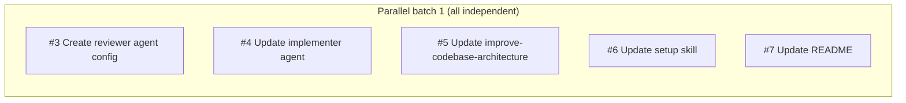

# Dependency Graph

```mermaid
graph LR
  subgraph "Parallel batch 1 (all independent)"
    T3[#3 Create reviewer agent config]
    T4[#4 Update implementer agent]
    T5[#5 Update improve-codebase-architecture]
    T6[#6 Update setup skill]
    T7[#7 Update README]
  end
```

All tasks are independent — no blockers. Execute in any order or all in parallel.
