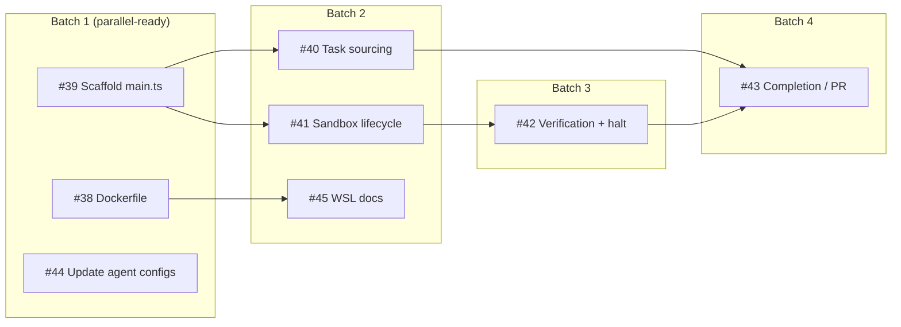

# Dependency Graph

```mermaid
graph LR
  subgraph "Batch 1 (parallel-ready)"
    T38[#38 Dockerfile]
    T39[#39 Scaffold main.ts]
    T44[#44 Update agent configs]
  end
  subgraph "Batch 2"
    T40[#40 Task sourcing]
    T41[#41 Sandbox lifecycle]
    T45[#45 WSL docs]
  end
  subgraph "Batch 3"
    T42[#42 Verification + halt]
  end
  subgraph "Batch 4"
    T43[#43 Completion / PR]
  end
  T39 --> T40
  T39 --> T41
  T38 --> T45
  T41 --> T42
  T40 --> T43
  T42 --> T43
```
