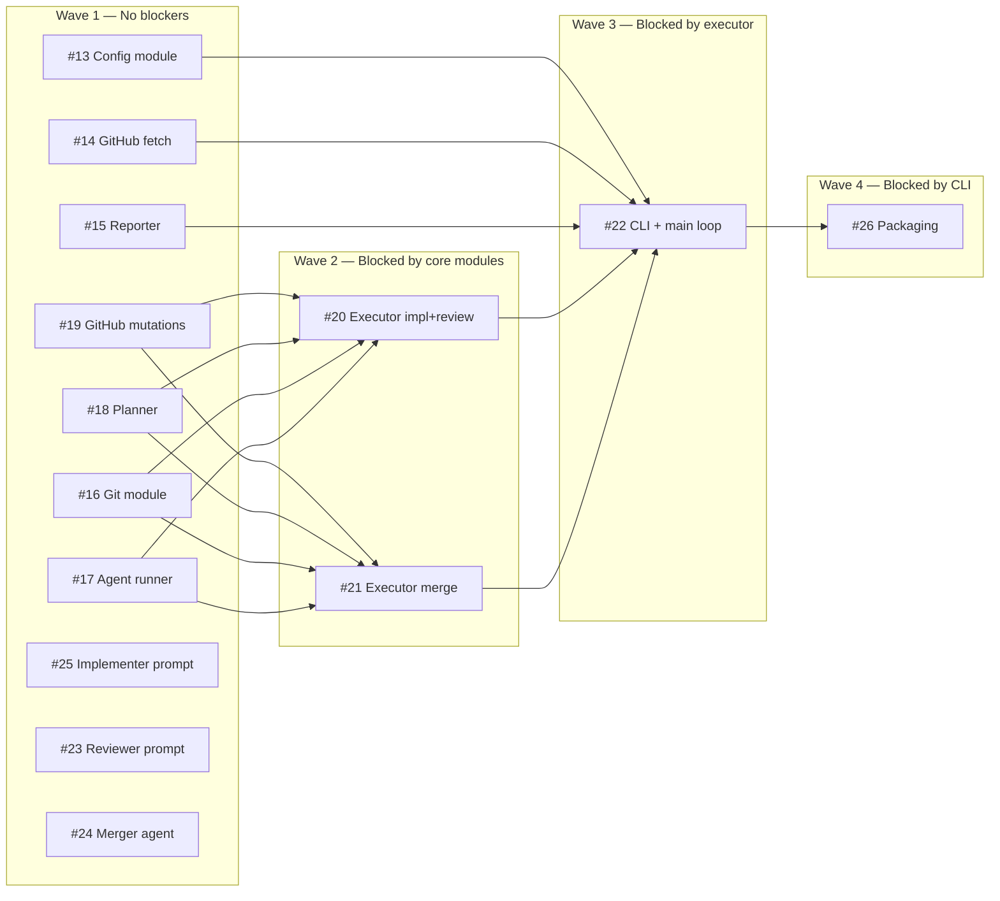

# Dependency Graph

```mermaid
graph LR
  subgraph "Wave 1 — No blockers"
    T13[#13 Config module]
    T14[#14 GitHub fetch]
    T19[#19 GitHub mutations]
    T18[#18 Planner]
    T16[#16 Git module]
    T17[#17 Agent runner]
    T15[#15 Reporter]
    T25[#25 Implementer prompt]
    T23[#23 Reviewer prompt]
    T24[#24 Merger agent]
  end

  subgraph "Wave 2 — Blocked by core modules"
    T20[#20 Executor impl+review]
    T21[#21 Executor merge]
  end

  subgraph "Wave 3 — Blocked by executor"
    T22[#22 CLI + main loop]
  end

  subgraph "Wave 4 — Blocked by CLI"
    T26[#26 Packaging]
  end

  T19 --> T20
  T18 --> T20
  T16 --> T20
  T17 --> T20

  T19 --> T21
  T18 --> T21
  T16 --> T21
  T17 --> T21

  T13 --> T22
  T14 --> T22
  T15 --> T22
  T20 --> T22
  T21 --> T22

  T22 --> T26
```
