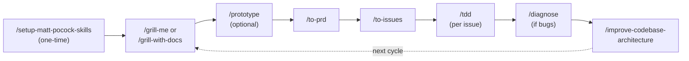
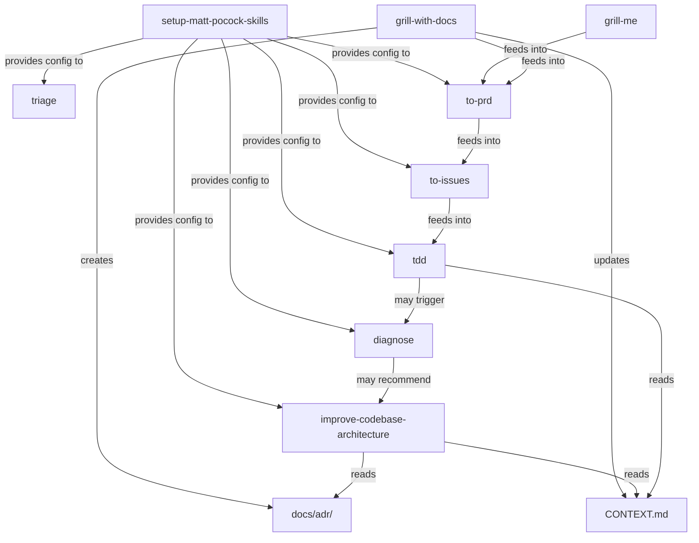
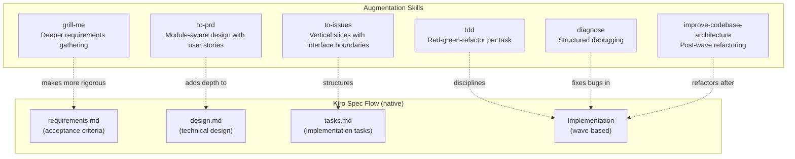

# Claude Skills → Kiro Analysis Report

## 1. Matt Pocock Skills Codebase Overview

The [mattpocock/skills](https://github.com/mattpocock/skills) repository is a collection of composable agent skills for Claude Code. Skills are markdown-based instruction sets that Claude Code loads on-demand via slash commands.

### Repository Structure

```
mattpocock/skills/
├── .claude-plugin/plugin.json    # Skill registry (lists all active skill paths)
├── CLAUDE.md                     # Always-loaded project rules for Claude Code
├── CONTEXT.md                    # Domain glossary (shared language)
├── skills/
│   ├── engineering/              # Daily code work skills
│   ├── productivity/             # Non-code workflow skills
│   ├── misc/                     # Rarely used
│   ├── personal/                 # Author-specific (not promoted)
│   ├── in-progress/              # Drafts
│   └── deprecated/               # No longer used
├── scripts/                      # Utility scripts
└── docs/adr/                     # Architecture Decision Records
```

### Skill File Format (Claude Code)

```markdown
---
name: skill-name
description: What it does. Use when [triggers].
---
# Instruction body (loaded on-demand when triggered)
```

The `description` field is surfaced in Claude Code's system prompt. Claude reads all descriptions and picks the relevant skill based on the user's request. The body is only loaded when the skill is activated.

---

## 2. Workflow: Entry Points & Sequence



### Entry Points (User-Initiated)

| Step | Skill | What It Does |
|------|-------|-------------|
| 0 | `setup-matt-pocock-skills` | One-time repo config: issue tracker type, triage labels, domain doc layout |
| 1 | `grill-me` / `grill-with-docs` | Relentless interview until shared understanding. Updates CONTEXT.md + ADRs |
| 2 | `prototype` | Throwaway code to answer design questions (terminal app or UI variations) |
| 3 | `to-prd` | Synthesizes conversation into a PRD with modules, user stories, testing decisions |
| 4 | `to-issues` | Breaks PRD into vertical-slice issues (tracer bullets) with dependency ordering |
| 5 | `tdd` | Red-green-refactor loop per issue — one test → one impl → repeat |
| 6 | `diagnose` | Structured debugging: feedback loop → reproduce → hypothesise → fix |
| 7 | `improve-codebase-architecture` | Find shallow modules, propose deepening opportunities |

### Supporting Skills (Triggered by Others or Ad-Hoc)

| Skill | Role |
|-------|------|
| `triage` | State-machine for issue lifecycle (needs-triage → ready-for-agent) |
| `zoom-out` | Ask agent to explain code at higher abstraction level |
| `handoff` | Compact conversation into doc for another agent session |
| `caveman` | Ultra-compressed communication mode (~75% fewer tokens) |
| `write-a-skill` | Meta-skill for creating new skills |

---

## 3. Skill Dependency Graph



---

## 4. Mapping to Kiro Equivalents

### Concept Mapping

| Claude Code Concept | Kiro Equivalent | Rationale |
|-------------------|----------------|-----------|
| `SKILL.md` (on-demand instruction) | `.kiro/skills/**/SKILL.md` via `skill://` | Both use YAML frontmatter, both load on-demand |
| `CLAUDE.md` (always-loaded rules) | `.kiro/steering/*.md` (inclusion: always) | Both always in context, define project rules |
| `CONTEXT.md` (domain glossary) | Project-root `CONTEXT.md` | Domain glossary, read by skills on demand |
| `.claude-plugin/plugin.json` (registry) | Agent `resources: ["skill://..."]` | Agent config declares available skills |
| Slash commands (`/grill-me`) | Natural language triggers | Kiro skills trigger on description match, not slash commands |
| `setup-matt-pocock-skills` | Not needed | Kiro uses agent config + steering files for per-repo setup |

### Activation Differences

| Claude Code | Kiro |
|------------|------|
| `/skill-name` slash command | Natural language: "grill me about this" |
| Explicit invocation required | Auto-triggered when description matches user intent |
| Skills loaded via plugin.json | Skills loaded via agent `resources` field |
| One agent (Claude Code) | Multiple agents possible, switchable mid-session |

---

## 5. Augmentation Strategy

The Claude skills don't replace Kiro's spec flow — they **enhance** each phase:



---

## 6. Parallel Wave Execution: Gap Analysis

### The Gap

Kiro's spec workflow (requirements → design → tasks → implement) runs in a **single context window**. All tasks execute sequentially within one session:
- Context accumulates, risking confusion on later tasks
- No parallelism — independent tasks are serialized
- A failure in task N pollutes context for task N+1

### The Ideal

Each task is implemented independently by a fresh agent, tested in isolation, corrections identified, then a new agent takes on another task. Multiple agents work in parallel on all tasks in a wave. Tasks define their own interfaces/utilities to avoid editing the same files.

### Kiro Workarounds

#### Option A: Scripted `kiro-cli` Headless Mode (Recommended)

```powershell
# Coordinator spawns parallel agents per task
$wave = Get-WaveTasks -TasksFile "tasks.md" -Wave 1
$jobs = $wave | ForEach-Object {
    Start-Job {
        param($task, $dir)
        Set-Location $dir
        kiro-cli chat --no-interactive --trust-all-tools --agent implementer $task
    } -ArgumentList $_.prompt, $PWD
}
$jobs | Wait-Job | Receive-Job
```

Key capabilities:
- `--no-interactive` — headless, no user input
- `--trust-all-tools` — no approval prompts
- `--agent implementer` — constrained agent with `allowedPaths` per task
- Fresh context window per invocation
- Exit code 0/1 for success/failure

#### Option B: ACP (Agent Client Protocol)

`kiro-cli acp` exposes JSON-RPC over stdin/stdout. A custom orchestrator could:
- Spawn multiple ACP sessions
- Send `session/new` + `session/prompt` to each
- Monitor `TurnEnd` events
- Coordinate results

Most powerful but requires custom tooling.

### Design Constraints for Parallel Tasks

1. **Interface boundaries**: Each task defines its own types/interfaces in its own files
2. **No shared file edits**: Tasks in the same wave never touch the same file
3. **Coordinator joins**: After a wave, a coordinator step wires modules together
4. **Vertical slices**: Each task is a complete path through all layers (schema → API → UI → tests)

---

## 7. Future Work

### QA/Review Skill (Not In Scope)

A separate agent that runs post-implementation:
- Identify security issues
- Identify suboptimal code
- Highlight things for human review
- Auto-review before human review

### AI Style Doc Skill (Not In Scope)

- Research UI styles
- Generate markdown style guide
- Use for frontend implementation consistency

### Caveman Mode (Not In Scope)

Ultra-compressed communication (~75% token reduction) — already exists as a steering file.

### Handoff Skill (Not In Scope)

Compact conversation into portable doc for another agent/session — partially covered by `/chat save`.
