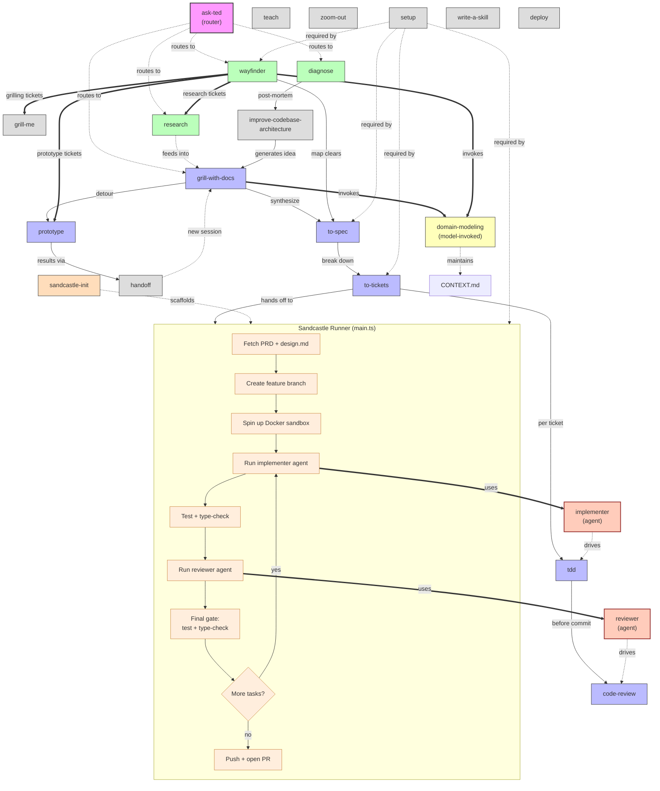

# Skill Linkages

How skills connect, invoke, and hand off to each other.



## Legend

| Style | Meaning |
|-------|---------|
| Pink | Router (entry point) |
| Blue | Main flow (idea → ship) |
| Green | On-ramps (generate work, merge onto main flow) |
| Yellow | Model-invoked vocabulary layers |
| Orange box | Sandcastle runner (autonomous execution) |
| Red-outlined | Agents (implementer, reviewer) |
| Grey | Standalone / productivity / meta |

## Edge types

| Edge | Meaning |
|------|---------|
| `→` solid | Hands off to / next step in flow |
| `==>` thick | Invokes as sub-skill during execution |
| `-.->` dotted | Feeds into / routes to / optional relationship |

## Sandcastle process (per task)

```
Fetch PRD → Create branch → Docker sandbox
    ↓
┌─────────────────────────────────────┐
│  For each unblocked task:           │
│                                     │
│  implementer agent (TDD)            │
│       ↓                             │
│  test + type-check                  │
│       ↓                             │
│  reviewer agent (Standards + Spec)  │
│       ↓                             │
│  FINAL GATE: test + type-check      │
│       ↓                             │
│  ❌ fail → halt immediately         │
│  ✅ pass → next task                │
└─────────────────────────────────────┘
    ↓
Push branch + open PR
```

## Invocation summary

| Skill/Agent | Type | Invoked by |
|-------------|------|-----------|
| domain-modeling | model-invoked | grill-with-docs, wayfinder, any skill when terms are fuzzy |
| code-review | model-invoked | tdd (before commit), reviewer agent (quality gate), user directly |
| research | model-invoked | wayfinder (research tickets), user directly |
| prototype | model-invoked | grill-with-docs (detour), wayfinder (prototype tickets), user directly |
| tdd | model-invoked | to-tickets (per ticket), implementer agent (per task), user directly |
| implementer | agent | sandcastle runner (per task) |
| reviewer | agent | sandcastle runner (after implementer, always) |
