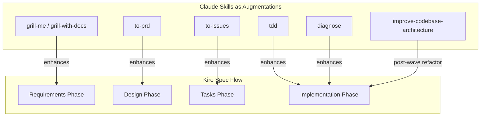
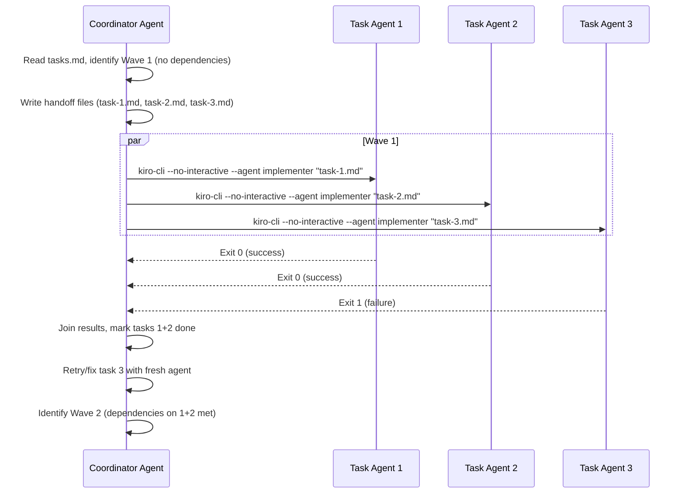

# Implementation Plan — Claude Skills → Kiro Skill Converter

## Problem Statement

Convert Matt Pocock's Claude Code skills into Kiro-native constructs. The skills are NOT 1:1 replacements for Kiro's spec flow — they **augment** how Kiro executes its requirements → design → tasks → implement cycle. Additionally, design a coordinator pattern for parallel wave execution using `kiro-cli` headless mode.

## Requirements

1. **Converter Skill**: A Kiro skill that reads Claude skill source, recommends a Kiro mapping, explains activation, and generates output after user confirmation
2. **Augmentation Skills**: Convert key Claude skills (`grill-me`, `tdd`, `to-prd`, `to-issues`, `diagnose`, `improve-codebase-architecture`) as Kiro skills that enhance each phase of the spec flow
3. **Wave Coordinator**: A script + agent pattern where a coordinator spawns sub-agents per task in a wave, tasks define their own interfaces to avoid file conflicts, and the coordinator joins results
4. **Report**: Markdown analysis document with Mermaid diagrams
5. **QA/Review**: Noted as future work

---

## Background: Mapping Philosophy



| Kiro Phase | Claude Skill Augmentation | What It Adds |
|-----------|--------------------------|-------------|
| Requirements | `grill-me` / `grill-with-docs` | Relentless interview, domain glossary sharpening, ADR creation |
| Design | `to-prd` | Module identification, deep-module thinking, user stories |
| Tasks | `to-issues` | Vertical-slice decomposition, HITL/AFK classification, dependency ordering |
| Implementation | `tdd` | Red-green-refactor discipline, anti-horizontal-slice enforcement |
| Implementation | `diagnose` | Structured debugging with feedback loops |
| Post-wave | `improve-codebase-architecture` | Deepening opportunities, shallow→deep module refactoring |

---

## Parallel Wave Coordinator Pattern



### Key Design Principle

Each task defines its own interfaces and utilities. Tasks in the same wave MUST NOT edit the same files. The coordinator handles integration (wiring modules together) as a separate step after the wave completes.

### Kiro Capabilities Used

- `kiro-cli chat --no-interactive --trust-all-tools --agent <name>` — headless execution per task
- `--agent` — purpose-built agent with constrained `toolsSettings.write.allowedPaths` per task
- Exit codes (0/1) for success/failure detection
- `/chat save` / `/chat load` for session portability
- Agent `hooks.stop` to capture completion artifacts
- Fresh context window per invocation (no pollution between tasks)

### Limitations to Work Around

- No built-in wave/dependency resolution → script handles this
- No mid-session user input in headless → tasks must be fully specified in handoff files
- File conflicts → task design must enforce interface boundaries (each task owns its files)

---

## Proposed Solution: Deliverables

```
D:\Projects\skills\
├── docs/
│   └── claude-skills-analysis.md          # Full report with Mermaid diagrams
├── skills/
│   ├── convert-claude-skill/
│   │   ├── SKILL.md                       # The converter skill
│   │   └── MAPPING.md                     # Decision tree + templates
│   ├── grill-me/
│   │   └── SKILL.md                       # Augments requirements phase
│   ├── to-prd/
│   │   └── SKILL.md                       # Augments design phase
│   ├── to-issues/
│   │   └── SKILL.md                       # Augments tasks phase
│   ├── tdd/
│   │   ├── SKILL.md                       # Augments implementation phase
│   │   ├── tests.md                       # Good/bad test examples
│   │   └── mocking.md                     # Mocking guidelines
│   ├── diagnose/
│   │   └── SKILL.md                       # Structured debugging
│   └── improve-codebase-architecture/
│       ├── SKILL.md                       # Post-wave refactoring
│       └── LANGUAGE.md                    # Architecture vocabulary
├── scripts/
│   └── wave-runner.ps1                    # Parallel wave coordinator script
├── agents/
│   ├── skill-converter.json              # Agent for running the converter
│   └── implementer.json                  # Agent template for task execution
└── README.md                              # Setup instructions
```

### How Skills Get Activated

Skills are installed by adding to any agent's resources:
```json
{
  "resources": [
    "skill://skills/**/SKILL.md"
  ]
}
```

Or globally at `~/.kiro/skills/` for use across all projects.

Each skill triggers based on its `description` field — Kiro loads it on-demand when the user's request matches.

---

## Task Breakdown

### Task 1: Save this plan and create the analysis report

- **Objective**: First save this entire plan as `implementation-plan.md`. Then write `docs/claude-skills-analysis.md`
- **Includes**: Mermaid diagrams for: skill dependency graph, workflow sequence, Kiro mapping, coordinator pattern
- **Test**: Renders correctly in any Markdown viewer with Mermaid support

### Task 2: Create the converter skill

- **Objective**: Write `skills/convert-claude-skill/SKILL.md` and `MAPPING.md`
- **SKILL.md**: Guided conversion process — reads source, recommends mapping, explains activation, generates after confirmation
- **MAPPING.md**: Decision tree for mapping Claude constructs to Kiro equivalents

### Task 3: Convert `grill-me` as a requirements-phase augmentation skill

- **Objective**: Write `skills/grill-me/SKILL.md`
- **Key adaptation**: Enhances Kiro's requirements phase with relentless interviewing

### Task 4: Convert `to-prd` as a design-phase augmentation skill

- **Objective**: Write `skills/to-prd/SKILL.md`
- **Key adaptation**: Outputs compatible with Kiro's `design.md` spec structure

### Task 5: Convert `to-issues` as a tasks-phase augmentation skill

- **Objective**: Write `skills/to-issues/SKILL.md`
- **Key adaptation**: Emphasizes interface boundaries for parallel execution

### Task 6: Convert `tdd` as an implementation-phase augmentation skill

- **Objective**: Write `skills/tdd/SKILL.md` + `tests.md` + `mocking.md`
- **Key adaptation**: Enforces one-test-one-impl vertical slice cycle

### Task 7: Convert `diagnose` as a debugging skill

- **Objective**: Write `skills/diagnose/SKILL.md`

### Task 8: Convert `improve-codebase-architecture` as a post-wave skill

- **Objective**: Write `skills/improve-codebase-architecture/SKILL.md` + `LANGUAGE.md`

### Task 9: Create the wave-runner script and implementer agent

- **Objective**: Write `scripts/wave-runner.ps1` and `agents/implementer.json`

### Task 10: Create the skill-converter agent and README

- **Objective**: Write `agents/skill-converter.json` and `README.md`

---

## Future Work (Not In Scope)

- **QA/Review Skill**: Auto-review before human review — identify security issues, suboptimal code, things to highlight
- **AI Style Doc Skill**: Research UI styles, generate a markdown style guide
- **Caveman Mode**: Ultra-compressed communication for token savings (~75% reduction)
- **Handoff Skill**: Compact conversation into portable doc for another agent/session
