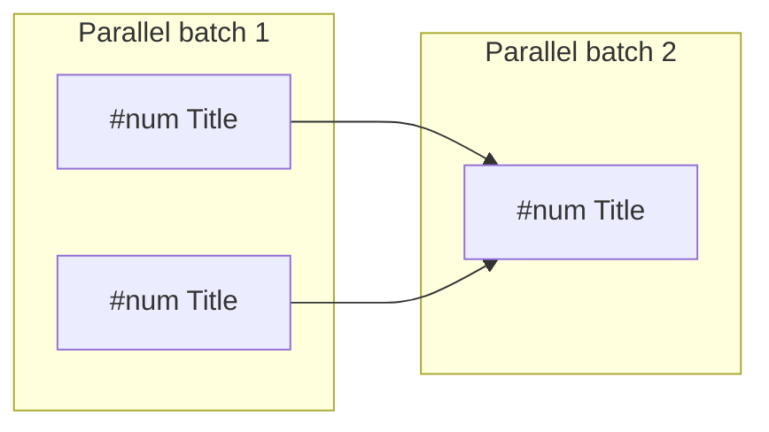

# To Tickets

Break a plan into independently-implementable vertical slices. Publishes to GitHub Issues or local markdown depending on project config.

Reads issue tracker config from `.kiro/steering/project-config.md`. Run `setup` first if missing.

## Process

### 1. Gather context

Work from whatever is already in the conversation — design.md or discussion. If the user passes a reference (a spec path, an issue number or URL), fetch it and read its full body.

### 2. Explore the codebase (if needed)

Understand current state. Use the project's domain glossary vocabulary. Respect ADRs in the area being touched.

Look for opportunities to **prefactor** the code to make the implementation easier. "Make the change easy, then make the easy change."

### 3. Draft vertical slices

Break the plan into **tracer bullet** tickets.

Rules:
- Each slice cuts a narrow but COMPLETE path through every layer (schema, API, UI, tests) — **vertical**, NOT a horizontal slice of one layer
- A completed slice is demoable or verifiable on its own
- Each slice is sized to fit in a single fresh context window
- Any prefactoring should be a separate first ticket

Give each ticket its **blocking edges** — the other tickets that must complete before it can start. A ticket with no blockers can start immediately.

#### Wide refactors: expand-contract

**Wide refactors are the exception to vertical slicing.** A wide refactor is one mechanical change (rename a column, retype a shared symbol) whose blast radius fans across the whole codebase — no vertical slice can land green because a single edit breaks thousands of call sites at once.

Don't force it into a tracer bullet. Sequence it as **expand–contract**:

1. **Expand** — add the new form beside the old so nothing breaks (its own ticket)
2. **Migrate** — move call sites over in batches sized by blast radius (per package, per directory), each batch its own ticket blocked by the expand. CI stays green batch-to-batch because the old form still exists
3. **Contract** — delete the old form once no caller remains (ticket blocked by every migrate batch)

When even the batches can't stay green alone, keep the sequence but let them share an integration branch — green is promised only at the final integrate-and-verify ticket.

### 4. Quiz the user

Present the breakdown as a numbered list. For each ticket show:
- **Title**: short descriptive name
- **Blocked by**: which other tickets (if any) must complete first
- **What it delivers**: the end-to-end behaviour this ticket makes work

Ask:
- Does the granularity feel right? (too coarse / too fine)
- Are the blocking edges correct?
- Should any tickets be merged or split further?

Iterate until approved.

### 5. Publish to the configured tracker

#### If GitHub (per project-config.md)

Publish issues in dependency order (blockers first) so IDs are available. Use [GITHUB-API.md](./GITHUB-API.md) for exact API patterns.

For each ticket:
1. Create with `gh api` (to get the `id` back)
2. Link as sub-issue of the parent spec issue
3. Add `blocked_by` dependencies for each blocker
4. Apply `ready-for-agent` label

Issue body template:

```markdown
## What to build

The end-to-end behaviour this ticket makes work, from the user's perspective — not a layer-by-layer implementation list.

## Acceptance criteria

- [ ] Criterion 1
- [ ] Criterion 2
- [ ] Criterion 3

## Blocked by

- #N Title (or "None — can start immediately")
```

Avoid specific file paths or code snippets — they go stale fast. Exception: if a prototype produced a snippet that encodes a decision more precisely than prose (state machine, schema, type shape), inline it trimmed to the decision-rich parts.

#### If local (per project-config.md)

Write one file per ticket under `.scratch/{name}/issues/{NN}-{slug}.md`, numbered from `01` in dependency order (blockers first):

```markdown
# {Title}

**Status:** ready-for-agent
**Blocked by:** {numbers/titles of blocking tickets, or "None — can start immediately"}

## What to build

The end-to-end behaviour this ticket makes work, from the user's perspective.

## Acceptance criteria

- [ ] Criterion 1
- [ ] Criterion 2
```

#### Both modes: generate dependency diagram

Write a mermaid diagram to `.kiro/specs/{title}/dependency-graph.md`:



Compute batches: tasks with no unresolved blockers = batch 1, tasks whose blockers are all in earlier batches = batch 2, etc.
